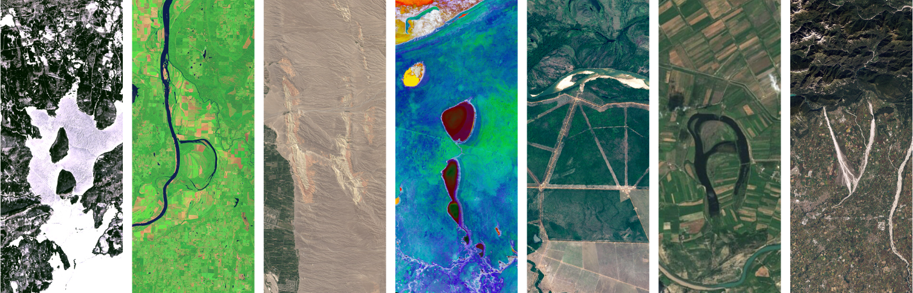

# 🛰️ NASA Landsat Image Downloader

> **Bulk-download NASA Landsat letter images in seconds — no more typing one word at a time.**

Inspired by the **trending social media reels** where creators spell out names, messages, and captions using stunning satellite imagery from NASA's Landsat program. This tool automates the tedious part so **video editors and content creators** can focus on what they do best — creating amazing content.



---

## 🎬 The Problem

You've seen the viral reels — each letter of a word rendered as a breathtaking satellite image from NASA's [Your Name in Landsat](https://science.nasa.gov/specials/your-name-in-landsat/) page. They look incredible, but downloading them is painfully slow:

1. Go to the NASA page
2. Type a word
3. Wait for it to generate
4. Download the image
5. **Repeat for every. single. word.**

For a video editor working with dozens of captions, this can eat up **hours** of productive time.

## ⚡ The Solution

This Chrome extension automates the entire workflow. Enter all your captions at once, hit one button, and every image is generated, captured, and saved to a dedicated folder — ready to drag into your editing timeline.

**What used to take hours now takes seconds.**

---

## ✨ Features

- 🚀 **Batch Processing** — Enter multiple captions (space-separated) and download all images in one go
- 📂 **Organized Downloads** — All images are automatically saved to `Downloads/nasa_images/` with clean filenames
- 🎯 **Smart Image Capture** — Captures directly from the page's canvas for maximum quality
- 📊 **Real-time Progress** — Live progress bar and detailed log showing each caption's status
- 🔄 **Auto-inject** — Content script is automatically injected when needed, no manual refresh required
- 🎨 **Sleek Dark UI** — Beautiful, space-themed popup interface that feels native to the NASA experience
- 💾 **Persistent Input** — Your last set of captions is remembered between sessions

---

## 🛠️ Installation

### Chrome (Developer Mode)

1. Download or clone this repository:
   ```bash
   git clone https://github.com/your-username/nasa-landsat-image-downloader.git
   ```

2. Open Chrome and navigate to:
   ```
   chrome://extensions/
   ```

3. Enable **Developer mode** (toggle in the top-right corner)

4. Click **"Load unpacked"**

5. Select the `extension/` folder from the cloned repository

6. Pin the extension by clicking the puzzle piece icon (🧩) in the toolbar and pinning **NASA Landsat Image Downloader**

---

## 🚀 Usage

### Using the Chrome Extension

1. **Click the extension icon** in Chrome's toolbar
2. If you're not on the NASA page, click **"Open NASA Page"** — it will navigate you there
3. Once the page loads, **click the extension icon again**
4. The status badge will show 🟢 **"Connected to NASA Landsat page"**
5. **Enter your captions** in the input field, separated by spaces:
   ```
   HELLO WORLD NASA LANDSAT
   ```
6. Click **"Generate & Download"**
7. Watch the progress as each image is generated and downloaded
8. Find your images in `Downloads/nasa_images/`

### Using the Python Script (Alternative)

A standalone Python script (`one.py`) is also included for users who prefer a CLI approach:

```bash
pip install selenium webdriver-manager
python one.py
```

Enter your space-separated captions when prompted. Images are saved to a `landsat_images/` folder.

---

## 📁 Project Structure

```
nasa_auto_image/
├── README.md                          # You are here
├── one.py                             # Standalone Python/Selenium script
└── extension/                         # Chrome Extension
    ├── manifest.json                  # Extension manifest (MV3)
    ├── background.js                  # Service worker — handles downloads & tab management
    ├── content.js                     # Content script — interacts with the NASA page DOM
    ├── content-overlay.css            # Overlay UI styles shown during processing
    ├── popup.html                     # Extension popup interface
    ├── popup.css                      # Popup styling (dark space theme)
    ├── popup.js                       # Popup logic — caption input, progress tracking
    └── icons/
        ├── icon16.png                 # Toolbar icon (16x16)
        ├── icon48.png                 # Extension page icon (48x48)
        └── icon128.png                # Chrome Web Store icon (128x128)
```

---

## 🎥 For Video Editors & Content Creators

This tool was built with **you** in mind. Here's how it fits into your workflow:

| Without This Tool | With This Tool |
|---|---|
| Manually type each word on the NASA site | Enter all words at once |
| Wait & download one image at a time | Batch download — all at once |
| Images scattered in Downloads folder | Neatly organized in `nasa_images/` |
| 30+ minutes for a full set of captions | Under 2 minutes |
| Repetitive, mind-numbing work | One click and done |

### 💡 Tips for Creators

- **Use short, punchy words** — they look best as Landsat images
- **Each letter becomes a satellite image** — so "HELLO" gives you 5 letter-images combined into one
- **Downloaded PNGs are high quality** — perfect for 1080p and 4K video timelines
- **Organize by project** — rename the `nasa_images` folder after each batch to keep things tidy

---

## 🔧 How It Works

1. **Popup** → User enters captions and clicks "Generate & Download"
2. **Background Script** → Manages tab detection, content script injection, and file downloads via `chrome.downloads` API
3. **Content Script** → Injected into the NASA page, it:
   - Types each caption into the input field
   - Triggers the image generation
   - Captures the rendered canvas as a PNG data URL
   - Sends it back to the background script for organized download

### Image Capture Strategy (Priority Order)
1. 🎯 **Canvas capture** — Grabs the rendered image directly (preferred — enables organized download)
2. 🔗 **Download link** — Uses any `<a>` download link on the page
3. 🖼️ **Image element** — Finds the largest generated `` on the page
4. 📐 **SVG output** — Serializes any SVG result
5. 🔘 **Page download button** — Clicks the page's own download button as a fallback

---

## 🌟 Inspiration

This project is inspired by the **trending Instagram and TikTok reels** where creators use NASA's Landsat satellite imagery to spell out names, messages, and creative captions. These reels have gone viral for their stunning visuals — each letter is a real satellite photograph of Earth's surface that happens to resemble that letter.

Video editors and reel creators were spending **significant time** manually generating and downloading each image one by one from the NASA website. This tool was born out of the desire to **eliminate that repetitive work** and let creators focus on storytelling, editing, and producing content that inspires.

> _"Every minute saved on tedious downloads is a minute spent making better content."_

---

## 📋 Requirements

- **Google Chrome** (or any Chromium-based browser)
- An active internet connection to access the NASA Landsat page
- For the Python script: Python 3.7+, Selenium, webdriver-manager

---

## 📄 License

This project is open source and available under the [MIT License](LICENSE).

---

## 🙏 Acknowledgments

- **[NASA Landsat Program](https://landsat.gsfc.nasa.gov/)** — For the incredible satellite imagery
- **[Your Name in Landsat](https://science.nasa.gov/specials/your-name-in-landsat/)** — The web app that makes letter imagery possible
- **Content creators everywhere** — For inspiring this tool with your amazing viral reels

---

<p align="center">
  Made with 🛰️ by Abhinav Dixit
</p>
